L2/23-107
# Надлежащая поддержка сложных письменностей в текстовых терминалах.

_Рэньчжи ЛИ, Дастин ХОУЕТТ, Питер КОНСТЕБЛ_

Перевод [английского первоисточника](https://www.unicode.org/L2/L2023/23107-terminal-suppt.pdf)

## Аннотация

Терминальные среды и приложения с текстовым интерфейсом командной строки (CLI) обычно связаны с простыми реализациями верстки текста, которые не способны поддерживать многие системы письма, такие как арабская или деванагари.

В данном документе предлагается новый проект Unicode по разработке спецификаций (Terminal Complex Script Support, или TCSS), которые позволят терминальным средам и CLI обеспечивать комплексную поддержку письменностей Unicode. Эти спецификации могут быть в конечном итоге опубликованы в виде нового UTS или другой публикации Unicode. Стандартизация таких спецификаций будет способствовать совместимости между различными CLI и терминальными средами. Мы изложим основные требования TCSS и приведем примеры.

Наша цель — начать проект в Техническом комитете Unicode (UTC) по созданию подробной спецификации для TCSS и, при необходимости, координировать свои действия с другими организациями по стандартизации, чтобы стандартизировать любые части TCSS, которые могут выходить за рамки компетенции UTC.

## Введение

Приложения с интерфейсом командной строки (CLI) и текстовым пользовательским интерфейсом (TUI) играют важную роль в компьютерных системах, особенно для разработчиков программного обеспечения и системных администраторов. При работе с такими приложениями пользователи используют текстовые терминалы для взаимодействия с ними.

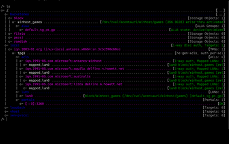

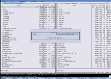

_Рисунок 1. Пример современного приложения CLI и TUI._

"Терминал" — это, как правило, аппаратное устройство или часть программного обеспечения, которые можно использовать для ввода данных в компьютер или вычислительную систему и для их расшифровки. Существует множество типов компьютерных терминалов, которые существовали в истории и существуют в настоящее время в современной промышленности, но наиболее распространенным подтипом является текстовый терминал, который работает с текстовыми потоками. Именно этот тип терминала мы будем в первую очередь иметь в виду на протяжении всего этого документа.

Долгое время текстовые терминалы поддерживали только европейские системы письма, в основном латиницу. Начиная с 1980-х годов они получили распространение в Восточной Азии и стали поддерживать CJK (китайскую, японскую и корейскую) системы письма. Однако даже на сегодняшний день (2023 год) большинство текстовых терминалов по-прежнему не имеют надлежащей поддержки более сложных систем письма, таких как деванагари и арабская, что затрудняет взаимодействие с ними почти для половины населения земного шара. По сравнению с другими текстовыми приложениями, такими как текстовые процессоры, программы верстки и веб-браузеры, текстовые терминалы значительно отстали от остальной части отрасли.

## Особенности текстового терминала

Текстовые терминалы произошли от телетайпных аппаратов ("TTY" или "телетайп"), которые выдавали неизменяемые твердые копии и имели одну однонаправленную "печатающую головку". Будучи подключенным к компьютеру, телетайп принимает пользовательский ввод с клавиатуры и печатает полученный от компьютера текст на рулоне бумаги. Телетайпы стали одним из первых пользовательских интерфейсов для компьютеров.

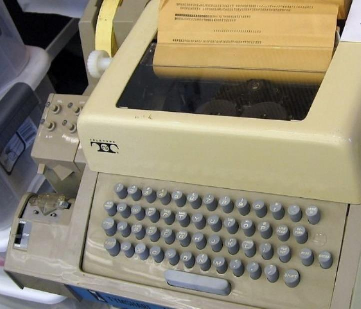

_Рисунок 2. Телетайп модели 33, широко использовавшийся в качестве компьютерного терминала._

Позднее широкое распространение среди операторов компьютеров получили текстовые терминалы, оснащенные блоком видеоотображения (например, ЭЛТ-экраном). Ранние модели видеотерминалов, как правило, эмулировали телетайпы, что позволило им заменить телетайпы в рамках мер по экономии средств.

Начиная с 1970-х годов видеотерминалы, подобные ADM-3A компании Lear Siegler, DEC VT52 и DEC VT100, вышли за рамки эмуляции телетайпов, предлагая гораздо больше функций. "Печатающая головка" прошлых лет стала адресуемой, что дало им возможность свободно печатать информацию в любом месте экрана. Эти устройства были тесно связаны с эпохой мини-компьютеров с разделением времени. Многие аппаратные терминалы поддерживают специальные управляющие последовательности для управления экранным отображением и вводом, некоторые из которых были стандартизированы как escape-последовательности "ANSI" (American National Standards Institute).¹

Принцип работы остается прежним: терминалы получают поток текстовых данных для отображения пользователю, который может воздействовать на него и отвечать с помощью устройства ввода, которое отправляет текстовый поток обратно на компьютер, подключенный к терминалу.

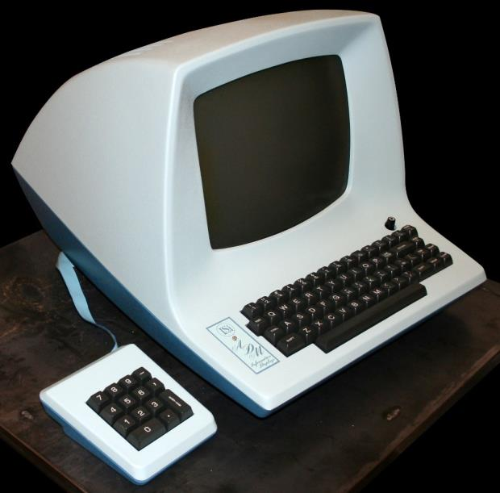

_Рисунок 3. ADM-3A, знаменитый видеотерминал, использовавшийся в 1970-х годах._

Начиная с конца 1980-х годов, в связи с ростом популярности графических пользовательских интерфейсов, программные эмуляторы текстовых терминалов постепенно вытеснили аппаратные терминалы. Среди известных примеров эмуляторов терминалов можно назвать xterm в Unix-подобных системах, iTerm2 на Macintosh и Windows Terminal в Windows.

В силу этой истории существует несколько особенностей реализации, которые сохранились как в аппаратных терминалах, так и в программных эмуляторах терминала:

*   **Для пользователя отображается текстовая поверхность — экран.**
*   **Текст, отображаемый на экране, выравнивается по сетке, которая разделена на строки и столбцы.** Пересечение одного столбца и одной строки называется ячейкой.
*   **Терминал получает вывод другого процесса или другой машины в виде текстового потока.** Выходной поток содержит либо управляющие последовательности, которые должны быть обработаны терминалом для выполнения определенных операций, либо графические символы, которые должны быть отображены на экране.
*   **Курсор представляет собой точку, в которой будет записан вводимый текст.** При записи текст перезаписывает существующее содержимое ячейки (ячеек) в позиции курсора.
*   **Приложения на "другом конце" сеанса терминала не могут легко определить предпочтительные параметры верстки текста терминала**, поскольку существует лишь ограниченное количество механизмов для запроса этих параметров.

В доюникодную эпоху верстка текста в терминалах была проста в реализации. Поскольку приложения обрабатывали только латиницу, они могли просто сопоставить один символ с одной экранной ячейкой. Однако это простое решение становится проблематичным, когда речь идет о более широком наборе поддерживаемых символов.

Страны Восточной Азии начали использовать компьютеры вскоре после западного полушария. Проблема, с которой они столкнулись, — это большой размер наборов символов, которые им требовались. Их ранние наборы символов, такие как Shift-JIS, BIG5 и GB2312, содержат тысячи символов и имеют схему кодирования переменной длины, в то время как терминалы того времени были рассчитаны на однобайтовые наборы символов. Кроме того, глифы для этих символов, как правило, были больше, чем их латинские аналоги. Последнюю проблему решили, позволив терминалу объединять две соседние ячейки в "широкую ячейку" и помещать все "широкие" символы из своего набора символов в широкие ячейки, помещая каждый байт кода широкого символа в каждую половину широкой ячейки. Такое решение создало ложную связь между количеством байтов, используемых для кодирования, и визуальной шириной символа в шрифтах с фиксированным шагом (моноширинных). Это одна из причин появления свойства East Asian Width, определенного в UAX #11.

_Рисунок 4. Один из экранов японского приложения IBM 5550, на котором показаны широкие символы. IBM 5550 — один из самых распространенных бизнес-компьютеров конца 1980-х годов в Японии. Он мог работать как компьютер MS-DOS, текстовый процессор или японский онлайн-терминал._

Однако этот механизм нельзя было распространить на более сложные системы письма, такие как арабская или деванагари. В этих системах письма символы образуют визуальные элементы гораздо более сложным образом: графема может быть составлена из нескольких символов, а ее визуальное представление и ширина могут меняться в зависимости от контекста. В результате практически все существующие реализации терминалов выдают некорректные результаты для этих систем письма.

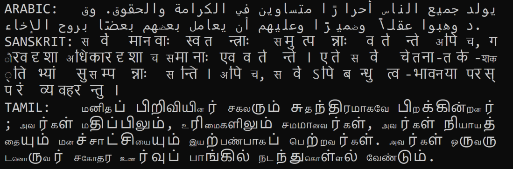

_Рисунок 5. Отображение статьи I Всеобщей декларации прав человека в Windows Terminal._

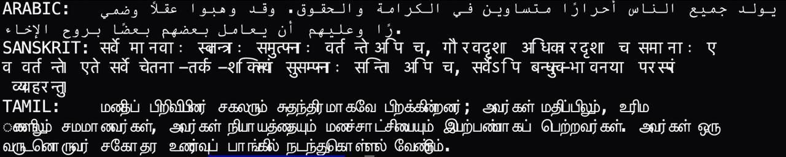

_Рисунок 6. Отображение статьи I Всеобщей декларации прав человека в "Terminal.app" от Apple._

Кроме того, многие современные приложения CLI и TUI обеспечивают "расширенное" отображение в терминале, основанное на "рисованных" символах (таких как определенные в блоках Box Drawing и Block Elements Unicode), чтобы сделать пользовательский интерфейс более приятным или удобным для навигации. Эти приложения, как правило, анализируют обрабатываемый ими текст, выполняют некоторую внутреннюю обработку верстки и отправляют сложные управляющие последовательности, такие как перемещение курсора и изменение стиля, в терминал, чтобы создать такой расширенный текстовый пользовательский интерфейс. В результате этим приложениям необходимо уметь прогнозировать поведение своих хост-терминалов при верстке текста, чтобы определять правильные управляющие элементы, отправляемые в терминал.

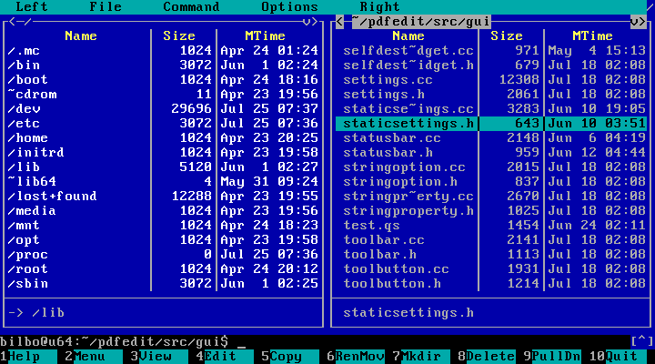

_Рисунок 7. Пример приложения TUI, использующего символы Box Drawing и стилизацию текста._

Однако, как уже упоминалось выше, приложения мало что знают о параметрах верстки текста терминала и общей пользовательской конфигурации. Следовательно, у приложения нет иного выхода, кроме как гадать — или использовать общий стандарт — о том, как будет отображаться текст сложных систем письма или сколько места будет занимать та или иная строка.

В результате мы приходим к выводу, что стандартизированная спецификация обработки текста в терминалах — это важная задача для современного сообщества разработчиков, а также всех остальных людей, использующих текстовые терминалы.

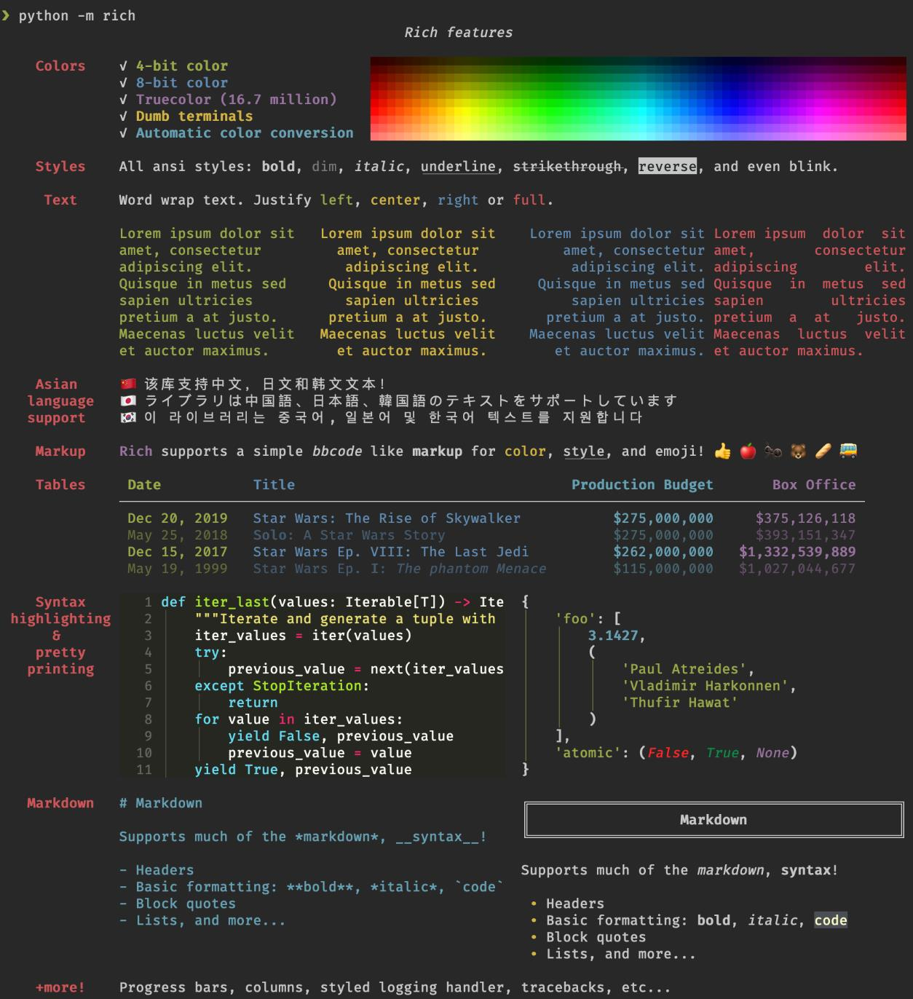

_Рисунок 8. Пример библиотеки Python "Rich", демонстрирующий ее способность отправлять сложные управляющие элементы в терминал для создания расширенного TUI._

## Ключевые требования

Обычно при верстке текста в приложениях с графическим пользовательским интерфейсом, помимо знания самого обрабатываемого текста, нам необходимо знать его стиль (шрифт, размер и другую дополнительную информацию). Это относится практически ко всем существующим приложениям верстки текста, таким как текстовые процессоры, веб-браузеры и т. д. Но этот подход не работает в случае с терминалами, поскольку, как обсуждалось в предыдущем разделе, как хост-терминал, так и гостевое приложение должны иметь возможность выполнять верстку текста, а гостевое приложение не обладает полной информацией о стиле текста, используемом в терминале.

Следовательно, если мы собираемся создать спецификацию TCSS, ее алгоритм верстки может полагаться только на обрабатываемую текстовую строку. Вместо того чтобы принимать шрифты в качестве входных данных, спецификация будет определять набор требований к шрифтам. Шрифты, соответствующие этим требованиям, называемые "терминальными шрифтами", будут правильно работать с алгоритмом верстки, определенным в спецификации. Результаты верстки, такие как позиции и метрики символов в тексте, будут измеряться в строках и ячейках терминала.

В результате TCSS должен содержать следующее:

*   **Спецификация поведения терминала**, включая:
    *   Поведение при записи текста.
    *   Перемещение курсора.
    *   Выделение и проверка нажатия.
*   **Спецификация верстки текста в терминале**, включая:
    *   Сегментацию (кластеризацию).
    *   Измерение.
    *   Двунаправленность (BiDi).
*   **Требования к "терминальным шрифтам".**
*   **Дополнительные управляющие последовательности**, при необходимости.

## Поведение при записи текста

Когда терминал получает текст от клиентских приложений, этот текст необходимо записать в его экранный буфер. Экранный буфер будет содержать несколько строк, где одна строка соответствует одной строке на конечном визуальном экране. Терминал также будет хранить курсор, указывающий место, где будет происходить обработка текста.

Исторически сложилось так, что один символ отображается в одну визуальную ячейку, однако для поддержки сложных письменностей это ограничение больше не может быть удовлетворено. В результате в терминалах, поддерживающих сложные письменности, каждый символ в экранном буфере будет иметь метрику, измеряющую его ширину, которая указывает, сколько ячеек он будет занимать. Это неотрицательное целое число, варьирующееся от нуля (для комбинирующих символов и т. д.) до некоторого относительно большого числа (например, для некоторых зависимых гласных в тамильском языке), ограниченного только доступной шириной эмулятора терминала.

Помимо ширины, символы могут иметь и другие свойства. Например, из-за требований к переупорядочиванию BiDi, которые будут рассмотрены в следующих разделах, символам в экранном буфере необходимо будет отслеживать уровень встраивания BiDi, а курсор будет поддерживать как логическую, так и визуальную позицию. Символы в буфере будут располагаться в логическом порядке, поскольку манипуляции с редактированием текста выполняются в логическом порядке.

Символы в одной строке будут дополнительно сгруппированы в терминальные кластеры. Терминальный кластер содержит символы, которые объединяются вместе в среде терминала. Это экземпляр адаптированного кластера графем, определенного в UAX #29. Например, в индийских письменностях слоги с вирама-соединителями в середине будут считаться одним терминальным кластером, в то время как в UAX #29 они рассматриваются как несколько расширенных кластеров графем.

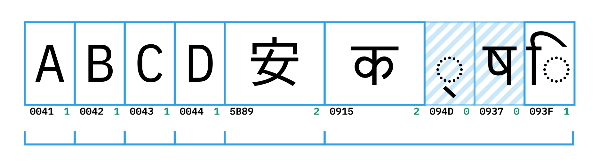

_Рисунок 9. Пример одной строки в экранном буфере с указанием символов, их ширины и границ кластеров. Символы нулевой ширины отмечены полосатым фоном._

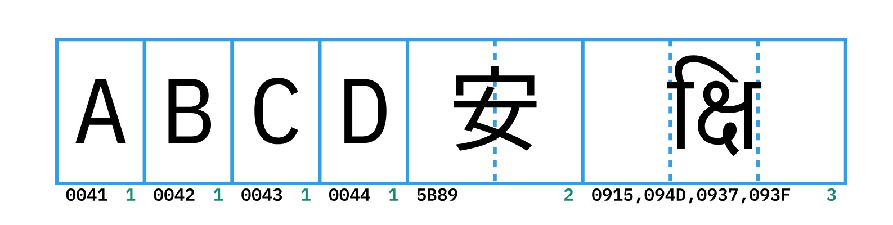

_Рисунок 10. Визуальное отображение строки экранного буфера. 6-й кластер (деванагари क्षि) будет занимать 3 ячейки, но содержать 4 символа._

Вывод текста в терминалах обычно работает в режиме перезаписи: при записи терминал всегда стирает все ячейки, занятые любым кластером, который пересекает любую часть вводимого текста, а затем вставляет новое содержимое. Процедура стирания выполняется путем замены существующих кластеров, занимающих необходимое пространство, на пустые кластеры.

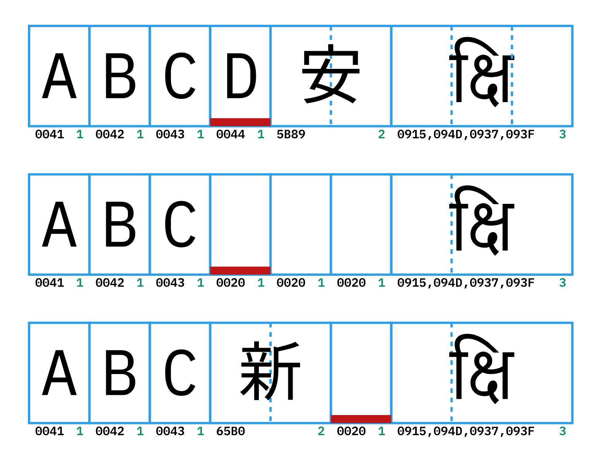

_Рисунок 11. Пример записи U+65B0 поверх ячейки 4. На этапе стирания кластеры 4 и 5 будут очищены до пробелов, а затем будет перезаписано новое содержимое._

В некоторых системах письма форма символа может зависеть от символов, следующих за ним. Одним из примеров этого являются формы репха в деванагари. Это требует создания рабочей зоны, содержащей самые последние символы, а свойство символов в рабочей зоне считается неустойчивым и может меняться в зависимости от вводимого текста.

Когда терминал получает текст, он сначала добавляет его в рабочую зону и измеряет всю рабочую зону для обработки потенциальных изменений свойств. Если результат измерения показывает, что текст в рабочей зоне можно разбить на несколько кластеров, то рабочая зона будет сокращена, чтобы содержать только последний (возможно, неполный) кластер. Текст перед ним будет зафиксирован, и его свойства больше не будут меняться. В результате в любой момент времени рабочая зона будет содержать не более одного кластера. При перемещении курсора (с помощью команды перемещения курсора или символа новой строки) весь текст в рабочей зоне фиксируется, даже если он неполный, и рабочая зона очищается.

_Рисунок 12. Процесс записи U+0B95, OBCD, OBB7, OBCC. Темно-красная зона — это рабочая зона. В правом столбце показана форма и ширина каждого символа в рабочей зоне. После записи U+0BB7 ширина U+0B95 устанавливается равной 3, а его форма — "Akhand". В результате рабочая зона расширяется и перекрывает кластер U+5B89 после него._

Мягкие переносы строк в терминале выполняются по границам кластеров, а не в соответствии с UAX #14. Учитывая, что рабочая зона содержит только последний кластер, перенос строки в терминале можно описать следующим образом: когда рабочая зона становится слишком широкой, чтобы поместиться в текущей строке, она перемещается в начало следующей строки, а занимаемые ею ячейки стираются пробелами.

## Измерение

Ключевым элементом TCSS является измерение. Терминал должен знать, сколько места занимает текст, прежде чем он сможет выделить ячейки в своем экранном буфере. Как показано в предыдущих разделах, многие существующие реализации терминалов выдают неверные результаты при работе со сложными письменностями, такими как деванагари и тамильский. Глифы размещаются в неправильных местах, что свидетельствует о том, что существующие средства измерения текста в этих реализациях несовместимы с такими сложными письменностями.

В настоящее время большинство терминалов и их гостевых приложений используют очень простые методы измерения текста. Большинство из них основаны на UAX #11 East Asian width, расширенном для поддержки большего количества символов. Реализации терминалов в Unix-подобных системах обычно используют функцию POSIX под названием wcwidth, чтобы узнать, сколько места занимает символ Unicode. Однако эта функция принимает только один аргумент — один код точки — и возвращает фиксированное значение, представляющее его ширину, что явно недостаточно для сложных письменностей, где несколько кодовых точек составляют один кластер графемы.

Для таких сложных письменностей форма символа варьируется в зависимости от окружающего контекста. Следовательно, его ширина также варьируется. Одним из известных примеров, иллюстрирующих эту проблему, являются эмодзи: если символ эмодзи соединен с предыдущим символом эмодзи в последовательности эмодзи с соединителем нулевой ширины (ZWJ), то этот символ больше не будет занимать места, поскольку теперь он "слит" с предыдущим символом (таблица 1). Если терминал использует wcwidth для измерения пространства, занимаемого составным эмодзи, он выделит слишком много места для эмодзи, оставив много места вокруг фактического текста (см. рисунок 13).

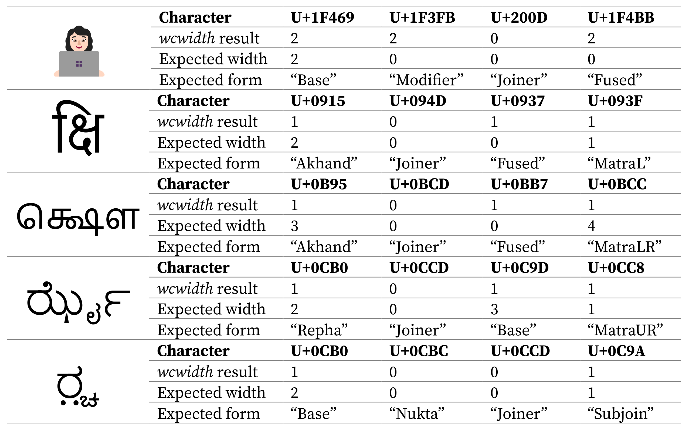

_Таблица 1. Небольшая выборка текста, результаты wcwidth и "ожидаемые" (expected) результаты._

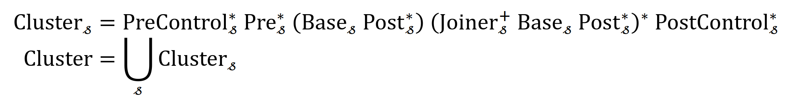

_Рисунок 13. Windows Terminal отображает эмодзи с модификатором тона кожи и компонентами ZWJ. Из-за неправильного измерения вокруг эмодзи добавляются лишние пробелы._

Следовательно, правильный измеритель должен отвечать следующим требованиям:

1.  Он должен принимать строку в качестве входных данных, чтобы полностью понимать контекст.
2.  Он должен уметь разбивать строку на терминальные кластеры.
3.  Он должен определять форму для каждого символа во входных данных.
4.  Он должен определять ширину для каждого символа во входных данных.

Пункт 2 предполагает, что алгоритм измерения должен иметь модель кластера, которая применима для большинства систем письма. В результате мы предлагаем создать модель кластера, упрощенную по сравнению с моделью кластера универсального механизма форматирования текста (Universal Shaping Engine) Эндрю Гласса. Базовая модель кластера выглядит следующим образом:

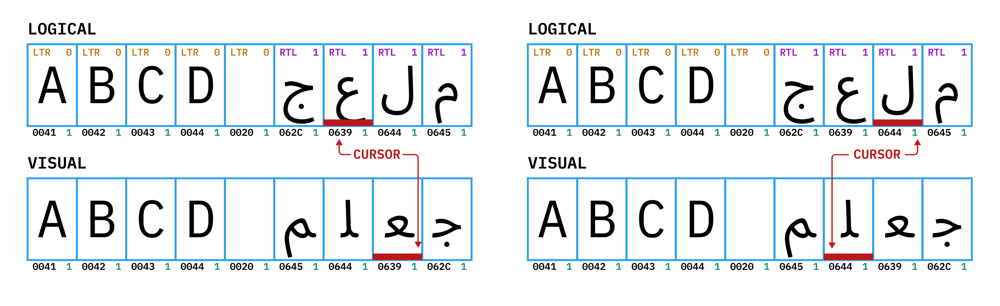

Для каждой письменности 𝓈 будет существовать набор наборов символов:

*   `PreControl𝓈`: управляющие символы перед кластером.
*   `PostControl𝓈`: управляющие символы после кластера.
*   `Base𝓈`: базовые символы.
*   `Pre𝓈`: дополнительные символы перед базой, например, модификаторы перед согласными в тайском языке.
*   `Post𝓈`: дополнительные символы после базы, например, диакритические знаки.
*   `Joiner𝓈`: соединители, объединяющие несколько баз, например, вирама или ZWJ.

Наборы символов `Base` для разных письменностей будут взаимоисключающими, в то время как другие наборы символов могут иметь общие символы в разных письменностях (например, ZWJ может использоваться в качестве соединителя во многих письменностях). Поскольку определение "кластера" представляет собой регулярный язык, процедура кластеризации может быть эффективно реализована с помощью конечного автомата.

Для достижения цели, указанной в пункте 3, алгоритму необходимо назначать информацию о "форме" для каждого символа в строке. Учитывая сложность систем письма, поддерживаемых Unicode, процесс определения формы должен управляться правилами, т. е. будет существовать один алгоритм и набор правил, который используется в качестве базы знаний для алгоритма. Мы могли бы иметь правила определения формы для латиницы, деванагари, арабского языка и эмодзи, а затем использовать их в совокупности в качестве набора правил для алгоритма.

Процесс назначения формы может быть реализован как "побочные эффекты" конечного автомата, выполняющего кластеризацию: когда конечный автомат идентифицирует дополнительные части кластера, мы можем использовать текущее состояние и вводимый символ, чтобы определить форму вводимого символа и изменить формы существующих символов в кластере, если это необходимо.

В результате часть спецификации, касающаяся измерения, будет содержать следующие компоненты:

*   Алгоритмы измерения, в основном анализатор формы и сегментатор.
*   Набор правил алгоритма измерения.
*   База данных для ширин символов, использующая кодовую точку и форму в качестве ключей запроса.

Учитывая широкое распространение wcwidth, предлагаемые алгоритмы измерения должны возвращать те же результаты, что и wcwidth, если входные данные считаются содержащими только "простые" символы.

## Двунаправленность и перемещение курсора

Поддержка двунаправленного текста (BiDi) — еще одна важная функция TCSS. Для поддержки BiDi экранный буфер терминала должен хранить следующую информацию:

*   **Границы абзацев**, поскольку анализ уровня встраивания BiDi выполняется для каждого абзаца.
*   **Уровень встраивания**, который пересчитывается при каждом изменении текста внутри абзаца.
*   **Потенциальные специальные управляющие данные** (например, переопределение уровня встраивания), которые будут полезны для сложных приложений TUI, выполняющих верстку текста самостоятельно, например, полноэкранные текстовые редакторы и IDE.

_Рисунок 14. Логический буфер и его визуальное представление строки, содержащей латинские и арабские символы. Уровень встраивания показан в строке логического буфера. После переупорядочивания порядок символов в визуальном представлении больше не совпадает с порядком в логическом буфере. В результате переупорядочивания курсор будет иметь как логическую, так и визуальную позицию._

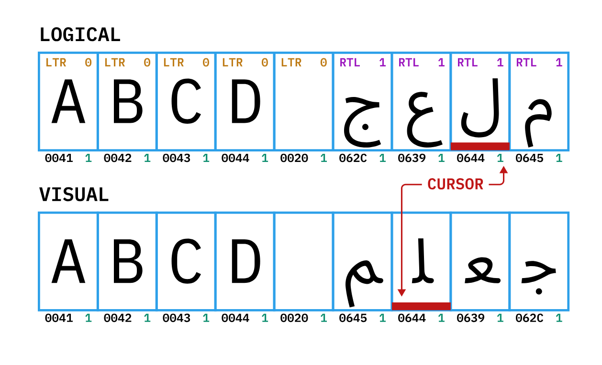

_Рисунок 15. Курсор после перемещения влево на одну ячейку. Логически он перемещается в конец строки._

Каждый раз, когда текст записывается в терминал, выполняется анализ уровня встраивания UAX #9 для изменяемых абзацев, а полученные уровни встраивания используются для окончательного переупорядочивания. Переупорядочивание выполняется построчно: текст в одной строке переупорядочивается в соответствии с его уровнем встраивания, и результат отправляется на дисплей.

В результате переупорядочивания курсор будет иметь логическую позицию и визуальную позицию. В то время как запись текста в основном использует логическую позицию, перемещение курсора работает на визуальном уровне, т. е. когда терминал решает переместить курсор вверх, ему нужно найти логическую позицию в предыдущей строке, которая имеет тот же столбец в своем визуальном представлении.

## Выделение и проверка нажатия

В современных терминалах выделение может быть выполнено двумя способами: либо выделить диапазон текста в логическом порядке, либо выделить прямоугольник текста в визуальном порядке. Чтобы выполнять все эти действия с выделением, а также перемещение курсора, терминал должен иметь возможность выполнять проверку нажатия, которая преобразует визуальные позиции (строка, столбец) в логические позиции (строка, символ, ячейка).

Мы определили бы две процедуры: "найти первый символ, занимающий определенную ячейку" и "найти последний символ, занимающий определенную ячейку", которые принимают визуальную позицию и строку экранного буфера, а затем находят первый или последний символ в строке, занимающий ячейку. С помощью этих процедур терминалы могли бы реализовать выделение.

## Требования к шрифтам

Поскольку в TCSS все измерения текста выполняются без использования шрифта, для правильного отображения конечного результата используемый в терминале шрифт также должен соответствовать определенным условиям, чтобы метрики глифов или поведение при форматировании соответствовали ожиданиям TCSS. В проекте TCSS можно определить ряд типографских функций, чтобы шрифты можно было применять с включенными этими функциями для получения правильных результатов.

## Управляющие последовательности

В некоторых случаях может потребоваться набор управляющих последовательностей, которые клиентские приложения могут отправлять на терминал для специальных целей, в том числе:

*   Переопределение определенных метрик текста.
*   Переопределение поведения BiDi по умолчанию или информации, например, уровня встраивания.
*   Разрыв абзаца BiDi в середине строки без вставки возврата каретки или перевода строки.

В рамках проекта TCSS следует определить места, где могут присутствовать специальные управляющие элементы, и разработать управляющие последовательности, которые можно было бы обсудить в других организациях по стандартизации, таких как ECMA или ISO.

\[Конец документа]
